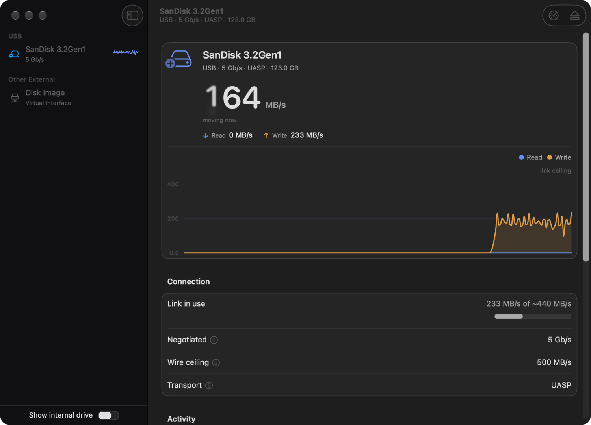

<p align="center">
  
</p>

<h1 align="center">Conduit</h1>

<p align="center">
  A macOS menu-bar app that measures USB storage speed in real time —<br>
  and tells you <em>why</em> a drive is slow, not just that it is.
</p>

<p align="center">
  
  
  
  
</p>

<p align="center">
  
</p>

---

## Why this exists

Every disk speed test tells you a number. None of them tell you what the number *means*.

If your drive writes at 38 MB/s, that could be a cheap drive, a USB 2.0 port, a bad cable, a
hub sharing bandwidth with four other things, or an enclosure that fell back to a slower
transfer protocol. The number is the same in every case. The fix is different in every case.

Conduit reads all four out of the IORegistry and names the culprit:

> **Capped at 480 Mb/s by a slower hop upstream.** The drive itself negotiated faster than
> this — plug it straight into the Mac to get its full speed.

It also says this **at the moment you plug the drive in**, which is the only moment the
information is still useful — before you start a forty-minute copy, not after.

## What it does

**Live** — passive monitoring of traffic macOS is already doing: read/write MB/s, IOPS,
per-operation latency, queue depth, errors and retries, plotted against the drive's
negotiated link ceiling. Samples at 4 Hz while data moves, 1 Hz when it doesn't.

**Speed test** — writes and reads a scratch file with the system cache disabled, so the
result describes the drive rather than your Mac's RAM. Results are kept per drive, so a
later run can answer the question a one-shot benchmark never can: *is this drive getting
worse?*

**Diagnosis** — negotiated link speed, UASP vs bulk-only transport, hubs in the path, and
error/retry counters that should be zero on healthy hardware.

## Install

### Build it yourself — recommended, and the only friction-free route

```bash
git clone https://github.com/ahmedasad89-design/conduit.git
cd conduit
./build.sh release
open Conduit.app
```

Needs Apple's Command Line Tools (`xcode-select --install`). **Xcode is not required** —
this project is built and tested entirely without it.

A locally built app carries no quarantine flag, so it just launches.

### Or download the release

Grab `Conduit.zip` from [Releases](../../releases), then:

```bash
xattr -dr com.apple.quarantine /Applications/Conduit.app
```

**That command is not optional.** Conduit is signed ad-hoc, not with a paid Apple Developer
certificate, so macOS quarantines it on download and refuses to launch it. I verified this
end to end: the downloaded copy is blocked, and removing the quarantine attribute makes it
launch normally. Notarising it properly costs $99/year, which this project does not have —
if enough people find it useful, that changes.

You are running an unsigned binary from the internet. The source is all here; building it
yourself takes about thirty seconds and is genuinely the better option.

## What I'd like feedback on

This has been tested against exactly **one** USB drive on **one** Mac, which is not a
sample size. The measurement code is careful but its assumptions are only proven against a
SanDisk 3.2Gen1 on an M3. Specifically:

| Area | What I need |
| --- | --- |
| **Thunderbolt / USB4 NVMe enclosures** | These report `PCI-Express`, not `USB`. They should appear under "Other External". Do they? Is the reported speed sane? |
| **Anything behind a hub or a dock** | The "capped by a slower hop upstream" warning has never fired on real hardware. Does it appear, and is it right? |
| **exFAT and FAT drives** | Most USB sticks ship exFAT, which can refuse a full flush to media. Conduit should say the sustained write figure is unverified. Does it? |
| **Bulk-only enclosures** | Older or cheaper enclosures skip UASP. Conduit should say so and halve its expected ceiling. |
| **Spinning rust, card readers, iPhones** | Untested entirely. |
| **Whether the numbers are right** | Cross-check against Blackmagic or AmorphousDiskMark and tell me if Conduit disagrees. A wrong number is the worst bug this app can have. |

Open an issue with the drive, the enclosure, your Mac, and what you saw. A screenshot of the
Connection section is worth more than a description.

Feature ideas welcome too, but correctness reports are the ones I'll act on first.

## How it measures

Every `IOBlockStorageDriver` publishes a `Statistics` dictionary of counters cumulative
since the driver attached. Conduit diffs them against elapsed time. No root, no kext, no
entitlements.

Three details do most of the work:

- **`CLOCK_MONOTONIC_RAW`, not wall time.** Throughput is a division by elapsed time; a
  clock that gets slewed by NTP silently corrupts every number on screen.
- **Elapsed is measured, not assumed.** Dividing by the nominal interval when the tick fired
  late inflates everything.
- **Counter restarts are absorbed.** Unplug and replug and the counters restart from zero; a
  naive delta emits a phantom multi-gigabyte spike.

### USB link speed: three properties, two different enums

Three IORegistry properties claim to answer "how fast is this link", and **they disagree
about how to encode it**. Read from real hardware:

| Property | Format | USB 2.0 hub | USB 3.2 hub | 5 Gb/s device |
| --- | --- | --- | --- | --- |
| `UsbLinkSpeed` | **bits/sec, unambiguous** | `480000000` | `10000000000` | `5000000000` |
| `USBSpeed` | `tIOUSBHostConnectionSpeed` — Full=1, Low=2, High=3, Super=4 | `3` | `5` | `4` |
| `Device Speed` | legacy enum — Low=0, Full=1, High=2, Super=3 | `2` | `4` | `3` |

Conduit prefers `UsbLinkSpeed`, which needs no table at all. Reading `Device Speed` with the
`USBSpeed` table turns a 480 Mb/s device into a 1.5 Mb/s one — silently plausible, and
exactly the kind of bug that ships.

### The speed test's phase order is load-bearing

`F_NOCACHE` stops *new* data being cached; it does **not** evict pages already resident.
Measured on the internal SSD with a 768 MB file:

| How the file was written | `F_NOCACHE` read result |
| --- | --- |
| **with** `F_NOCACHE` (what Conduit does) | **2346 MB/s** — the real SSD |
| without `F_NOCACHE` | **16955 MB/s** — the page cache |

Write the file cached and the subsequent read is a 7× fantasy no matter what flags the read
uses. Two write figures are reported for the same reason: the rate the drive *accepted* data,
and the rate once `F_FULLFSYNC` had committed it to media. On a drive with a large buffer
those differ, and the committed one is the honest number.

### Safety

The speed test refuses system volumes, read-only mounts, and any volume macOS itself hides
(`MNT_DONTBROWSE` — which is what catches the writable, non-obvious `/Volumes/Recovery`). It
re-checks free space at run time, requires the test size plus 10% headroom, deletes its
scratch file on every exit path including cancellation, and sweeps stranded files at launch.

## Cost

Watching a number is only worth it if watching is nearly free.

| State | CPU | Memory |
| --- | --- | --- |
| Idle | 0.2–2% | ~77 MB |
| Device selected, live chart drawing | ~5% | ~105 MB |
| Sampler itself, per tick | 0.5 ms (0.2%) | — |

That is not automatic — see `PublishGate` and the notes in
[STRATEGY.md](STRATEGY.md) §5. Sampling runs at 4 Hz but publishes to SwiftUI at 2 Hz, every
published collection is change-gated, the graph stops advancing once its whole window is
zero, and history is only kept for drives actually on screen.

## Development

```bash
swift build      # or ./build.sh release to produce the .app
./test.sh        # 60 tests
```

Swift Testing ships with the Command Line Tools but sits on no default search path, so
`Package.swift` spells out the macro plugin directory and two rpaths. Without them
`swift test` builds and then dies in `dlopen`.

[STRATEGY.md](STRATEGY.md) is the engineering log: the original audit, the five-phase
rebuild, and two rounds of adversarial review with everything they found. It is honest about
what was wrong, including the claims that turned out to be wrong.

## Known gaps

- Not notarised, so downloads need the quarantine command above.
- No share/export on the results card.
- Eject is on the toolbar only, not per row.
- SMART health over USB needs SAT passthrough; not planned.

## License

MIT — see [LICENSE](LICENSE).
